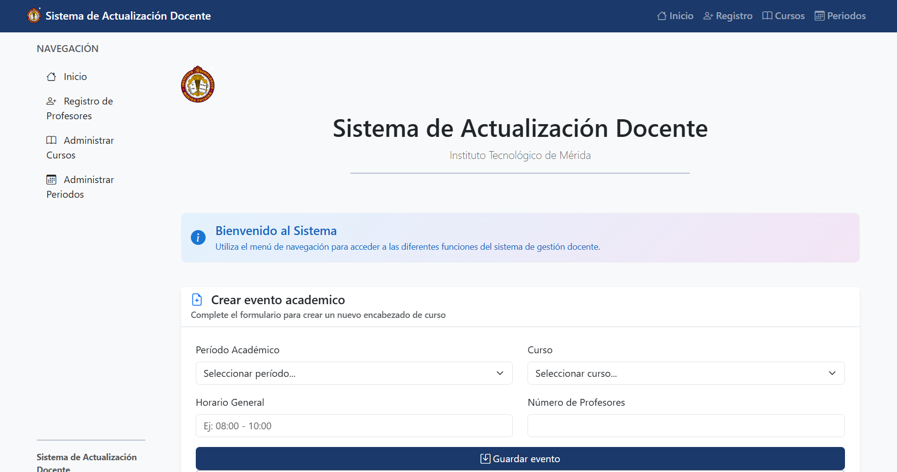
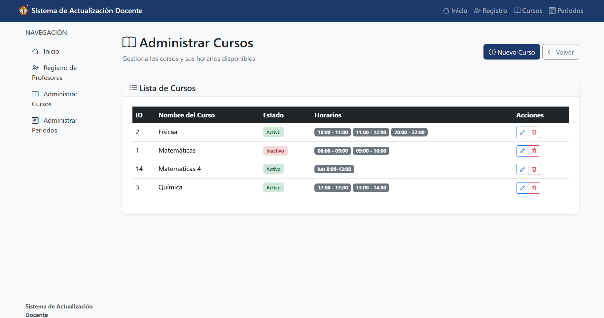
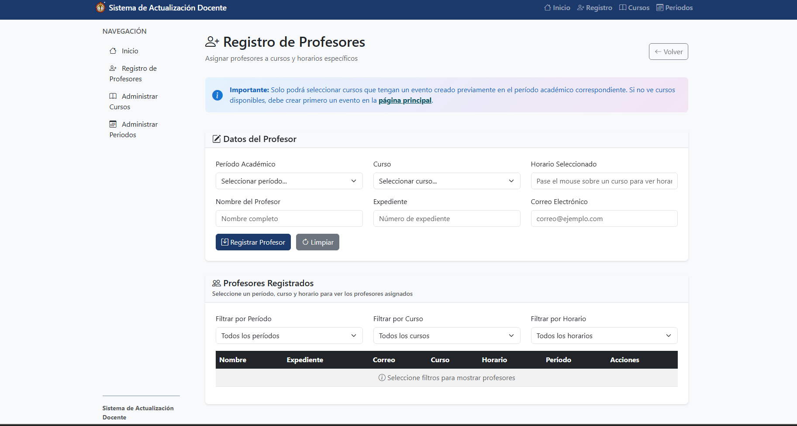

# 🎓 Sistema de Actualización Docente

<div align="center">
  
  
  [](https://choosealicense.com/licenses/mit/)
  [](https://php.net)
  [](https://getbootstrap.com)
  [](https://jquery.com)
  [](https://mysql.com)
</div>

## 📋 Descripción

El **Sistema de Actualización Docente** es una aplicación web desarrollada específicamente para el **Instituto Tecnológico de Mérida** que permite gestionar de manera eficiente la información de cursos, períodos académicos y el registro de profesores para diferentes materias y horarios.

### 🎯 Objetivo Principal

Facilitar la administración académica mediante una plataforma intuitiva que permita:
- Gestionar períodos académicos
- Administrar cursos y horarios
- Registrar y asignar profesores
- Generar reportes de asignaciones docentes

## ✨ Características Principales

### 🏫 Gestión Académica Completa
- **Administración de Cursos**: Crear, editar y gestionar cursos con sus respectivos horarios
- **Gestión de Períodos**: Manejo de períodos académicos (Ago-Dic, Ene-Jun)
- **Registro de Profesores**: Asignación de docentes a cursos específicos
- **Control de Horarios**: Gestión detallada de horarios por curso

### 💻 Interfaz Moderna
- **Diseño Responsivo**: Compatible con dispositivos móviles, tablets y escritorio
- **Interfaz Intuitiva**: Navegación clara y fácil de usar
- **Componentes Modulares**: Arquitectura escalable y mantenible
- **Bootstrap 5.3.3**: Framework moderno para una experiencia de usuario superior

### 🔧 Arquitectura Técnica
- **PHP Modular**: Estructura MVC con componentes reutilizables
- **Base de Datos MySQL**: Diseño relacional optimizado
- **APIs RESTful**: Endpoints organizados para operaciones CRUD
- **Responsive Design**: Adaptable a cualquier dispositivo

## 🚀 Instalación Rápida

### Requisitos Previos
- **XAMPP** (Apache, MySQL, PHP 7.4+)
- **Navegador web** moderno
- **Git** (opcional)

### Pasos de Instalación

1. **Descargar el proyecto**
   ```bash
   # Opción 1: Clonar repositorio
   git clone [URL-del-repositorio]
   
   # Opción 2: Descargar ZIP y extraer
   ```

2. **Configurar entorno**
   ```bash
   # Mover archivos a XAMPP
   C:\xampp\htdocs\ActualizacionDocente\
   ```

3. **Iniciar servicios**
   - Abrir XAMPP Control Panel
   - Iniciar **Apache** y **MySQL**

4. **Configurar base de datos**
   - Acceder a [phpMyAdmin](http://localhost/phpmyadmin)
   - Crear base de datos: `actualizaciondocente`
   - Importar: `sql/actualizaciondocenteDB.sql`

5. **Acceder al sistema**
   - Abrir: [http://localhost/ActualizacionDocente/](http://localhost/ActualizacionDocente/)

## 📱 Capturas de Pantalla

### Dashboard Principal


### Gestión de Cursos


### Registro de Profesores


## 🏗️ Arquitectura del Sistema

### Frontend
- **HTML5** con diseño semántico
- **Bootstrap 5.3.3** para componentes UI
- **jQuery 3.6.0** para interactividad
- **Bootstrap Icons** para iconografía
- **CSS3** personalizado para branding

### Backend
- **PHP 7.4+** para lógica del servidor
- **MySQL/MariaDB** para persistencia de datos
- **Apache** como servidor web
- **APIs RESTful** para comunicación

### Estructura de Carpetas
```
ActualizacionDocente/
├── 📁 api/              # Endpoints PHP
├── 📁 assets/           # Recursos estáticos
│   ├── 📁 css/         # Estilos personalizados
│   ├── 📁 img/         # Imágenes y logos
│   └── 📁 js/          # Scripts JavaScript
├── 📁 config/          # Configuración de BD
├── 📁 docs/            # Documentación
├── 📁 includes/        # Componentes reutilizables
├── 📁 sql/             # Scripts de base de datos
├── 📁 views/           # Vistas organizadas
├── 📄 CHANGELOG.md     # Registro de cambios
├── 📄 LICENSE      # Licencia MIT
└── 📄 README.md        # Este archivo
```

## 🔄 Historial de Cambios

Para ver el historial completo de cambios y evolución del proyecto, consulta:

**📋 [CHANGELOG.md](CHANGELOG.md)** - Registro detallado de todas las versiones y mejoras

### Últimas Actualizaciones v2.0.0
- ✨ Reestructuración completa del proyecto
- 🎨 Interfaz modernizada con Bootstrap 5.3.3
- 📱 Diseño completamente responsivo
- 🏗️ Arquitectura modular mejorada
- 🔧 APIs organizadas y optimizadas

## 📊 Estado del Proyecto

### ✅ Completado
- [x] Sistema de gestión de cursos
- [x] Administración de períodos académicos
- [x] Registro y asignación de profesores
- [x] Interfaz responsiva completa
- [x] Base de datos optimizada
- [x] Documentación completa

### 🚧 En Desarrollo
- [ ] Sistema de autenticación
- [ ] Reportes en PDF
- [ ] Notificaciones por email
- [ ] Panel de estadísticas

### 🔮 Próximas Características
- [ ] API REST completa
- [ ] Aplicación móvil
- [ ] Integración institucional
- [ ] Sistema de roles avanzado

## 🤝 Contribución

### Para Desarrolladores
1. Fork el proyecto
2. Crear rama feature (`git checkout -b feature/nueva-caracteristica`)
3. Commit cambios (`git commit -m 'Agregar nueva característica'`)
4. Push a la rama (`git push origin feature/nueva-caracteristica`)
5. Abrir Pull Request

### Para Usuarios Académicos
- 📝 Reportar bugs en Issues
- 💡 Sugerir mejoras
- 📖 Contribuir a documentación
- 🧪 Realizar pruebas

## 📞 Soporte

### Contacto Técnico
- **Email**: [soporte-tecnico@itmerida.mx]
- **Tel**: [+52 999 XXX XXXX]

### Documentación
- 📚 **[Wiki del Proyecto](docs/)**
- 🔧 **[Guía de Instalación](docs/INSTALL.md)**
- 🐛 **[Solución de Problemas](docs/TROUBLESHOOTING.md)**
- 📋 **[Changelog Completo](CHANGELOG.md)**

## 📄 Licencia

Este proyecto está licenciado bajo la **MIT License** - ver el archivo [LICENSE.txt](LICENSE.txt) para más detalles.

### 🎓 Uso Académico
Este software es especialmente diseñado para uso académico y educativo. Se permite y fomenta su uso en:
- Proyectos estudiantiles
- Investigación académica
- Enseñanza de desarrollo web
- Instituciones educativas

### 📝 Reconocimiento
Si utilizas este proyecto en tu trabajo académico, por favor cita:

```
Sistema de Actualización Docente (2025)
Instituto Tecnológico de Mérida
Disponible en: [URL del repositorio]
```

## 🏆 Reconocimientos

### 🏫 Institución
**Instituto Tecnológico de Mérida** - Por proporcionar el contexto y requisitos del proyecto

### 💻 Tecnologías
- [Bootstrap](https://getbootstrap.com) - Framework CSS
- [jQuery](https://jquery.com) - Biblioteca JavaScript
- [PHP](https://php.net) - Lenguaje del servidor
- [MySQL](https://mysql.com) - Sistema de base de datos

### 🎨 Recursos
- [Bootstrap Icons](https://icons.getbootstrap.com) - Iconografía
- [Unsplash](https://unsplash.com) - Imágenes de referencia

---

<div align="center">
  <p><strong>Desarrollado con ❤️ para la educación</strong></p>
  <p>Instituto Tecnológico de Mérida © 2025</p>
  
  [](https://github.com/usuario/repo)
  [](https://github.com/usuario/repo/issues)
  [](https://github.com/usuario/repo/graphs/contributors)
</div>
